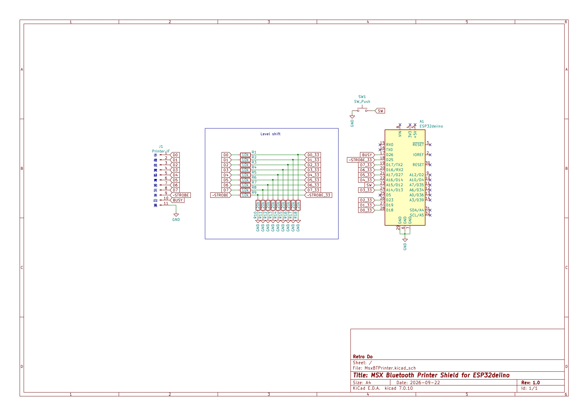
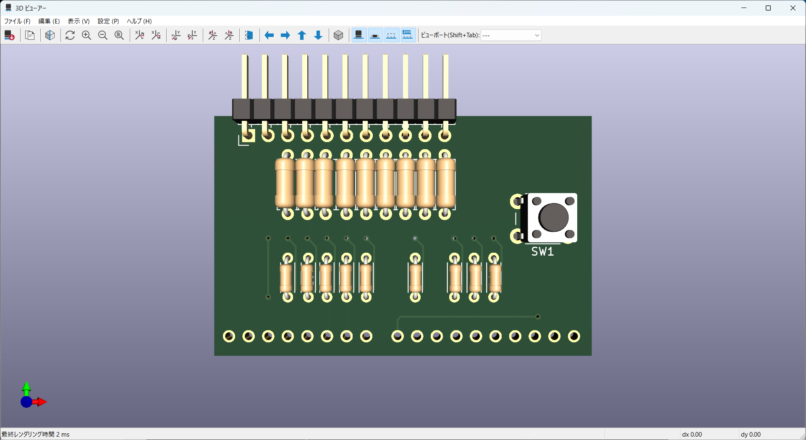

# MsxBtPrinter
MSX Bluetooth Printerシールド

## 概要
- ESP-WROOM-32開発ボードを使用したMSX用Bluetoothプリンタインターフェースです。
- MSXのプリンタポートから出力された印刷コマンドを、EPS32とBluetooth接続された三栄電機製モバイルプリンタ`BML-80BT`へ送信、印刷します。
  - MSX
  - -> アンフェノール14ピンケーブル（パラレル）
  - -> ESP-WROOM-32開発ボード＋本シールド
  - -> Bluetooth SPP
  - -> BML-80BT
- ESP-WROOM-32開発ボードには、aitendo「ESP-32でいいの」を使用しています。
- 開発環境はArduino IDEです。
- MSX → ESP32 の端子（D0～D7、~STROBE）は抵抗分圧で 5V → 3.3V にしています。
- ESP32 → MSX の端子（BUSY）は 3.3V のままMSXへ出力します。

## 対応文字
- MSXで使用される ASCII、半角カナ（ANKコード=JIS X 0201）に対応します。
- 2バイト文字（JIS第一水準、JIS第2水準）の漢字は対応しています（つもりです）が、一部の機種依存文字（ローマ数字など）は非対応です。
- グラフィック（ビットイメージ）の印刷は非対応です。
- 半角ひらがなと特殊文字（80H～9FH、E0H～FFH）、グラフィック文字（0140H～015FH）は、`BML-80BT`のダウンロードフォント機能を活用して今後対応予定です。

## 準備
- スケッチ内の変数`slaveAddress`に`BML-80BT`のBluetooth MACアドレス 6バイト を入力しておきます。
- MACアドレスは、`BML-80BT`のユーザーマニュアルに記載の「テスト印字」で確認できます。
  - FEEDボタンを押したまま電源を入れる。
  - STATUS LEDが赤点灯したら、FEEDボタンを離す。
- Arduino IDEでESP-WROOM-32に書き込みます。
- シールドを組み立てます。
  - 回路図内の`Printer IF`コネクタに記載された各ピンの色は、手持ちケーブルのケーブル色（参考）です。
  - 抵抗のワット数は1/4Wでなくても構いません。

## 使い方
- MSXのプリンタポートにケーブルを挿し、MSXと開発ボード、Bluetoothプリンタの電源を入れます。
  - 電源の投入順はどの順番でも構いません。
- 開発ボードとプリンタの接続が完了すると、ビープ音が3回鳴ります。
- MSXで`LPRINT`コマンドなどを打ち込むと、プリンタから印字されます。
- 印字直後は文字がプリンタ内部に隠れているので、シールド上のボタンを押して紙送りを行います。
- 漢字モードで`LPRINT`コマンドを打ち込むと、プリンタから全角文字が印字されます。

## 部品表
  | ボード | 個数 | 備考 |
  | --- | --- | --- |
  | ESP-WROOM-32 | 1 | https://www.aitendo.com/product/15730 |
  | ESP-32でいいの | 1 | https://www.aitendo.com/product/19514 |
  | 1/4W 抵抗 10k | 9 | |
  | 1/4W 抵抗 20k  | 9 | |
  | タクトスイッチ | 1 | https://www.aitendo.com/product/7048 |
  | アンフェノール14ピンケーブル | 1 | オス |

## 回路図
  

## 基板イメージ
  

## 製作例
  
  
